  

---

### About Me

I am a pragmatic, full-stack engineer focused on building performant, secure, and scalable systems.

- Senior Software Engineer at HackerRank, working on core code execution platform and cloud based IDE infrastructure.
- Open-source contributor and GSoC mentor at OpenWISP.
- Curious about distributed systems, reliability engineering, and developer experience.
- Website: **[codesankalp.com][website]**.

### Tech Stack

- Languages: `Go`, `Python`, `Ruby`, `TypeScript`, `JavaScript`, `SQL`, `Bash`
- Frameworks: `Django`, `Flask`, `Ruby on Rails`, `React`, `Next.js`, `Express.js`
- Infra/Platform: `Kubernetes`, `Docker`, `Terraform`, `AWS`, `GCP`, `Redis`, `Kafka`, `PostgreSQL`, `MySQL`
- Observability: `Prometheus`, `Grafana`, `ELK`

---

### GitHub and Coding Stats

<table align="center">
  <tr>
    <td>
      
    </td>
    <td>
      
       
      
    </td>
  </tr>
</table>

---

  <a href="https://codesankalp.com"><b>Visit my portfolio</b></a> •
  <a href="https://codesankalp.com/blog"><b>Read my blog</b></a>

  
  

  
  
  

  

[website]: https://codesankalp.com
[blog]: https://codesankalp.com/blog
[linkedin]: https://www.linkedin.com/in/codesankalp
[x]: https://x.com/codesankalp
[email]: mailto:sankalp.nex@gmail.com
